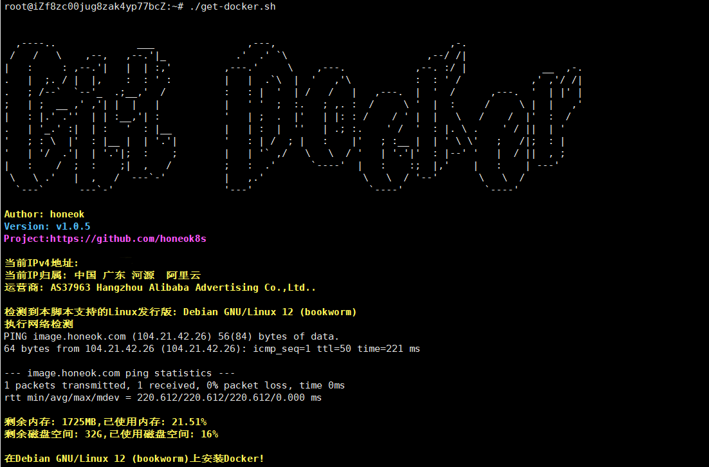

# get-docker

## 如何部署
docker & docker-compose一键部署最新版，根据IP归属指定对应配置文件优化，针对大陆鸡使用自定义镜像加速.

- 使用方法
```shell
curl -fsSL -O https://raw.githubusercontent.com/honeok8s/get-docker/dev/get-docker.sh && chmod +x ./get-docker.sh

# 默认安装 Docker
./get-docker.sh

# 卸载 Docker
./get-docker.sh uninstall
```


- 感谢B站伙伴提供的AS4837镜像加速地址，hub.littlediary.cn 不胜感激.